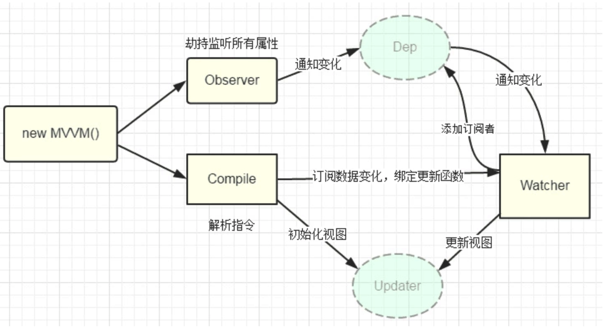

# CC大神养成记

**2020-02-18**

1. vue双向绑定

<<<<<<< HEAD

=======

>>>>>>> xiong

complie什么情况下使用。原理。

2. dom

讲讲虚拟dom(优点)。

3. diff

深度优先遍历，记录差异；差异类型；列表对比算法；diff(有无key)；patch

4. 生命周期

8个过程（创建前/后, 载入前/后,更新前/后,销毁前/销毁后）

5. Vue指定
   - v-text
   - v-html
   - v-bind
   - v-on
   - v-model
   - v-for
   - V-if

